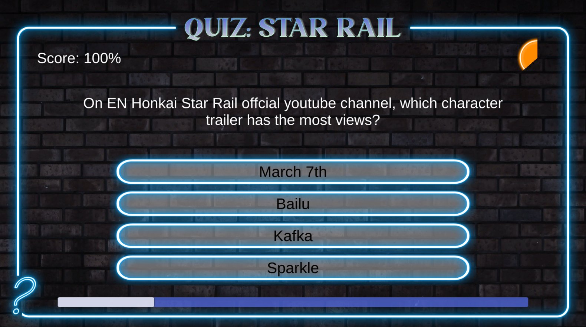
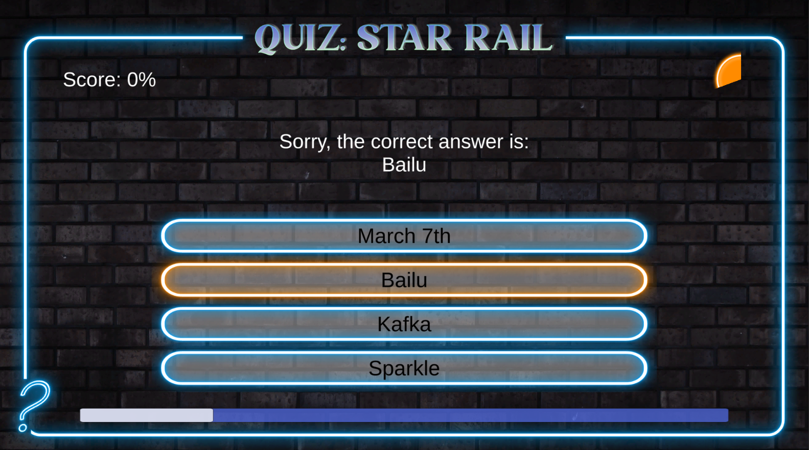
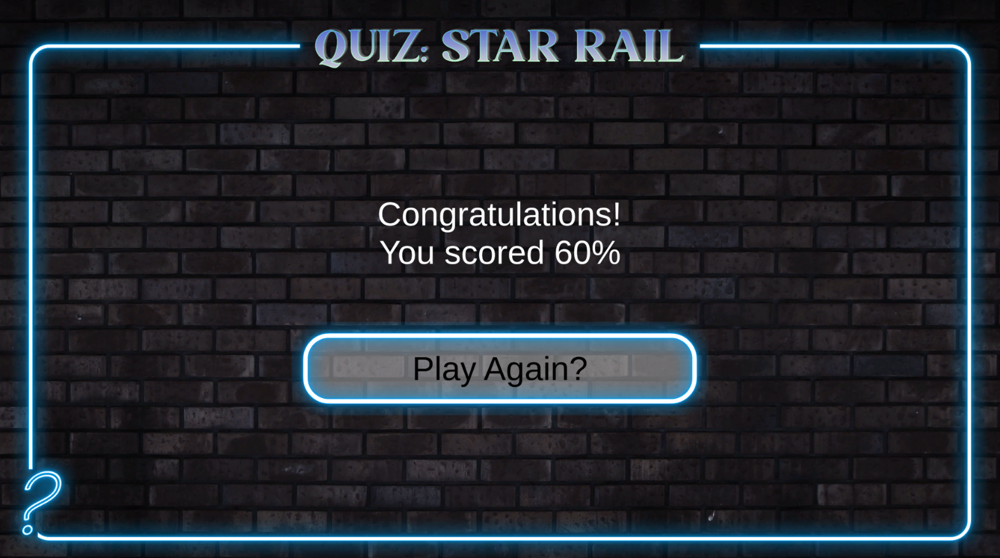

# Quiz: Star Rail
A practice project while learning Unity 2D. A game where the player tries to answer as many questions about the game *Honkai: Star Rail* correctly as possible to reach high scores.

## Layout
  

## Commands
Click the correct answer with left mouse button.

## Rules
There are 5 questions in total and the player has 10 seconds to answer each question. Unanswered questions will be treated as questions answered incorrectly.  
After answering a question, the correct answer will be displayed for 5 seconds and the next question will be displayed automatically.